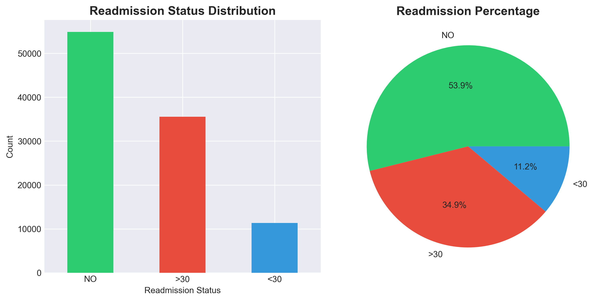
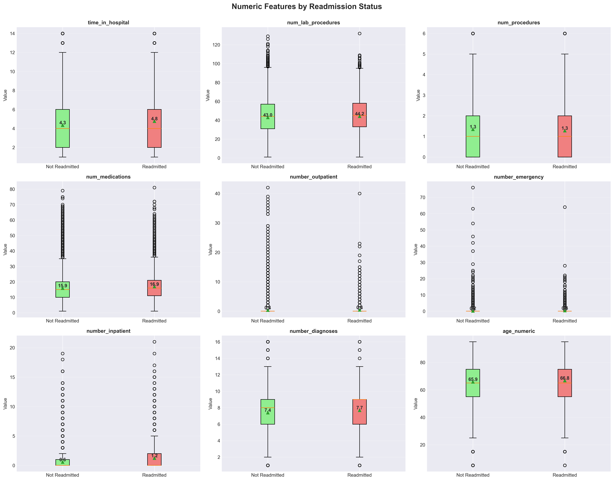
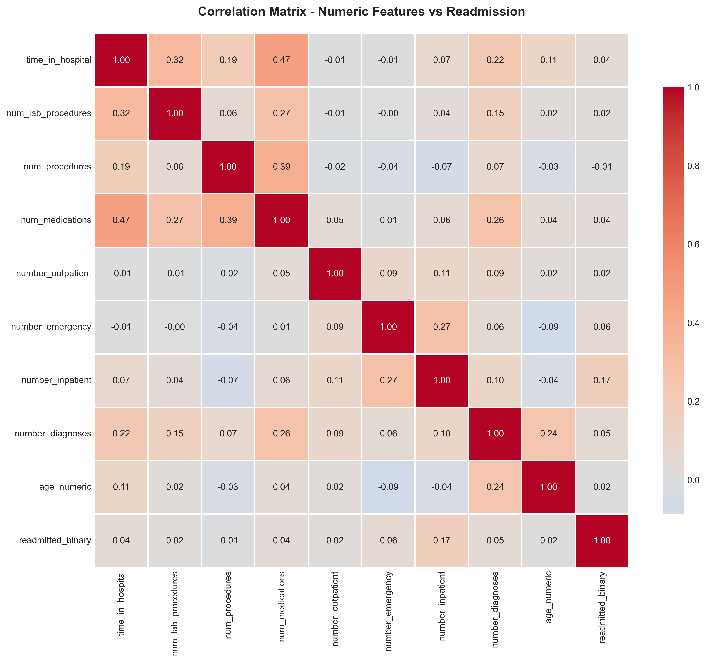
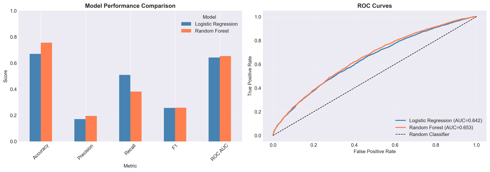
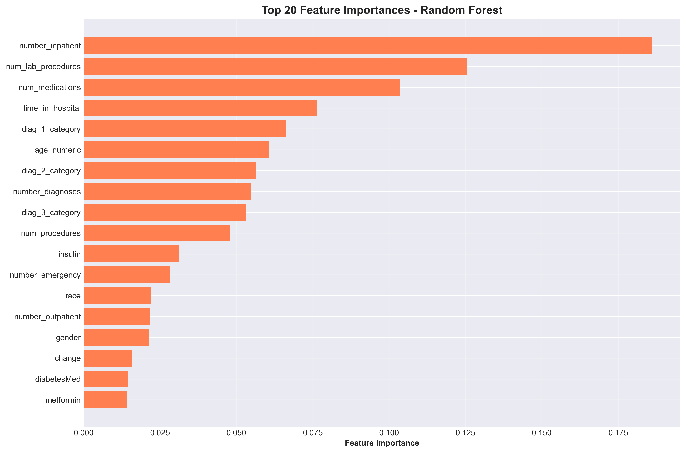
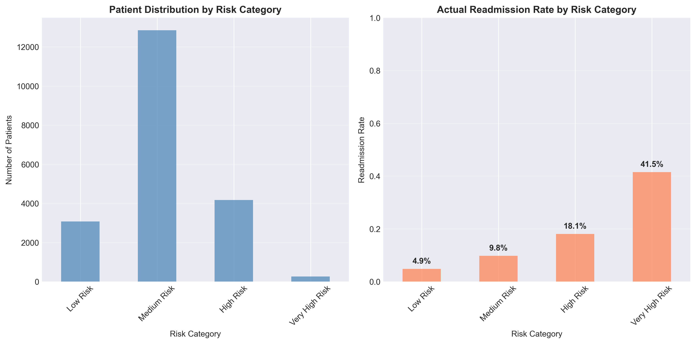
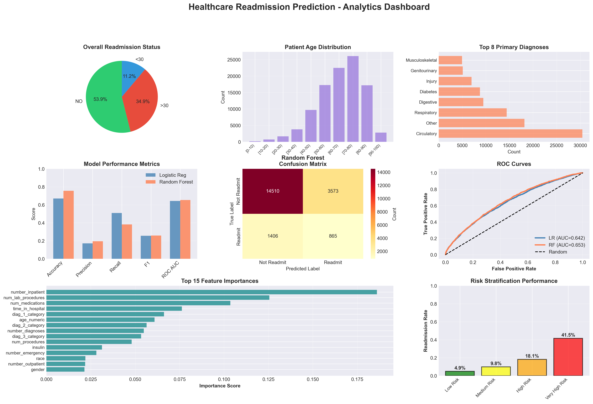

## 📊 Project Overview

A comprehensive end-to-end healthcare analytics project focused on predicting 30-day hospital readmissions for diabetes patients using machine learning techniques. The project covers the complete analytics pipeline including data acquisition, preprocessing, exploratory data analysis, predictive modeling, model evaluation, and business impact assessment.

### 🎯 Business Objectives

1. **Readmission Prediction** - Predict patients at high risk of 30-day hospital readmission using machine learning.
2. **Risk Stratification** - Categorize patients into risk groups for targeted clinical intervention.
3. **Healthcare Cost Analysis** - Estimate potential cost savings through early identification of high-risk patients.
4. **Clinical Decision Support** - Support healthcare providers with data-driven discharge planning and patient management.

### 💡 Key Results

- 🏥 **Dataset Size:** 101,766 hospital encounters from the Diabetes 130-US Hospitals dataset
- 📉 **30-Day Readmission Rate:** 11.16%
- 🤖 **Best Model:** Random Forest Classifier
- 🎯 **Model Accuracy:** 75.53%
- 📈 **ROC AUC Score:** 0.6529
- 💰 **Estimated Net Benefit:** $4,642,500 (Hypothetical Business Scenario)
- 👥 **Risk Stratification:** Four patient risk groups with up to 41.5% readmission rate in the Very High Risk category

---

## 📁 Project Structure

```text
Healthcare-Readmission-Prediction/
│
├── diabetic_data.csv                  # Raw healthcare dataset
├── diabetic_data_cleaned.csv          # Cleaned dataset
│
├── healthcare_analytics.py            # Complete analysis script
├── EXECUTIVE_SUMMARY.txt              # Executive report
│
├── visualizations/                    # All visualizations (12 files)
│   ├── 01_target_distribution.png
│   ├── 02_numeric_distributions.png
│   ├── 03_categorical_distributions.png
│   ├── 04_numeric_vs_readmission.png
│   ├── 05_categorical_vs_readmission.png
│   ├── 06_correlation_matrix.png
│   ├── 07_model_comparison.png
│   ├── 08_confusion_matrices.png
│   ├── 09_feature_importance.png
│   ├── 10_probability_distribution.png
│   ├── 11_risk_stratification.png
│   └── 12_FINAL_DASHBOARD.png
│
├── README.md                          # This file
└── requirements.txt                   # Python dependencies
```

---

## 🔬 Analytics Techniques Implemented

### Data Acquisition

- Healthcare dataset acquisition from the UCI Machine Learning Repository
- Data validation and initial exploration
- Dataset quality assessment
- Healthcare data inspection

### Data Preprocessing

- Missing value handling
- Placeholder value replacement
- Feature engineering
- ICD-9 diagnosis categorization
- Binary target variable creation
- Label Encoding
- Feature Scaling
- Age transformation

### Exploratory Data Analysis

- Univariate analysis
- Bivariate analysis
- Correlation analysis
- Distribution analysis
- Patient demographic analysis
- Clinical feature analysis

### Machine Learning

- **Logistic Regression** (Baseline classification model)
- **Random Forest Classifier** (Primary prediction model)
- Feature importance analysis
- Model comparison
- Probability prediction
- Risk stratification

### Model Evaluation

- Accuracy
- Precision
- Recall
- F1 Score
- ROC AUC
- ROC Curve
- Confusion Matrix
- Classification Report

---

## 🛠️ Installation & Setup

### Prerequisites

```bash
Python 3.9+
pip package manager
```

### Installation

1. **Clone the repository**

```bash
git clone https://github.com/Ankurr-01/Healthcare-Readmission-Prediction.git
cd Healthcare-Readmission-Prediction
```

2. **Install dependencies**

```bash
pip install -r requirements.txt
```

3. **Download the dataset**

Download the **Diabetes 130-US Hospitals Dataset (1999–2008)** from the UCI Machine Learning Repository and place the dataset in the project directory.

Expected filename:

```text
diabetic_data.csv
```

4. **Run the analysis**

```bash
python healthcare_analytics.py
```

**Runtime:** Approximately **10–15 minutes** for complete analysis.

---## 
📦 Dependencies

```text
pandas>=1.3.0
numpy>=1.21.0
matplotlib>=3.4.0
seaborn>=0.11.0
scikit-learn>=1.0.0
scipy>=1.7.0
```

---

## 📊 Key Visualizations

### Readmission Distribution



*Distribution of patient readmission outcomes highlighting class imbalance and the proportion of patients readmitted within 30 days.*

### Clinical Features vs Readmission



*Comparison of key clinical variables including hospital stay, laboratory procedures, medications, diagnoses, and healthcare utilization between readmitted and non-readmitted patients.*


### Correlation Analysis



*Correlation matrix illustrating relationships among numerical clinical variables and their association with patient readmission.*

### Model Performance Comparison



*Comparison of Logistic Regression and Random Forest models using Accuracy, Precision, Recall, F1-Score, and ROC-AUC, along with ROC curve evaluation.*

### Feature Importance



*Top predictive clinical features identified by the Random Forest model, highlighting the factors that contribute most to hospital readmission.*

### Patient Risk Stratification



*Patients categorized into Low, Medium, High, and Very High Risk groups based on predicted readmission probabilities, enabling targeted clinical interventions.*

### Executive Dashboard



*Comprehensive executive dashboard summarizing patient demographics, exploratory analysis, model performance, feature importance, risk stratification, and business impact.*

---
## 🎓 Learning Outcomes

### Technical Skills

✅ Healthcare data preprocessing
✅ Feature engineering

✅ Exploratory data analysis (EDA)
✅ Machine learning classification

✅ Model evaluation and validation
✅ Feature importance analysis

✅ Risk stratification
✅ Healthcare dashboard development

### Business Skills

✅ Healthcare analytics
✅ Clinical decision support

✅ Patient risk assessment
✅ Cost-benefit analysis

✅ Executive reporting
✅ Data-driven recommendations

---

## 📈 Key Findings & Recommendations

### Readmission Insights

- Overall **30-day hospital readmission rate:** **11.16%**
- Majority of patients belong to the **elderly population (median age 65 years)**.
- Prior inpatient admissions were identified as one of the strongest predictors of readmission.
- Emergency department utilization was positively associated with higher readmission risk.

### Model Performance

- Best performing model: **Random Forest Classifier**
- Test Accuracy: **75.53%**
- ROC AUC Score: **0.6529**
- Model captured **38.1%** of actual readmissions.
- Four patient risk categories were successfully identified, with the **Very High Risk** group showing a **41.5%** actual readmission rate.

### Business Impact

- Estimated patients requiring intervention: **4,440**
- Estimated readmissions prevented: **606**
- Estimated intervention cost: **$4,440,000**
- Estimated healthcare savings: **$9,082,500**
- Estimated net benefit: **$4,642,500**

### Strategic Recommendations

**Immediate Actions**

1. Implement discharge risk scoring for all diabetes patients.
2. Prioritize follow-up care for High and Very High Risk patients.
3. Strengthen medication reconciliation before discharge.
4. Enhance discharge planning protocols.

**Short-term (1–3 months)**

1. Integrate the prediction model into Electronic Health Record (EHR) systems.
2. Develop automated alerts for high-risk patients.
3. Improve transitional care coordination.
4. Monitor model performance through regular evaluation.

**Long-term (6–12 months)**

1. Expand the prediction model to additional chronic diseases.
2. Retrain the model using more recent hospital data.
3. Develop a real-time clinical decision support system.
4. Continuously optimize prediction performance through model monitoring.

---

## 🔍 Methodology Details

### 1. Data Acquisition

The project uses the **Diabetes 130-US Hospitals Dataset** from the UCI Machine Learning Repository.

- **101,766** hospital encounters
- Approximately **10 years** of historical patient records (1999–2008)
- Over **50** clinical, demographic, and administrative variables

### 2. Data Preprocessing

The preprocessing pipeline included:

- Missing value handling
- Placeholder value replacement
- Feature engineering
- ICD-9 diagnosis categorization
- Binary target variable creation
- Label encoding
- Feature scaling
- Age transformation

### 3. Exploratory Analysis

- Univariate analysis
- Bivariate analysis
- Correlation analysis
- Clinical feature exploration
- Patient demographic analysis
- Readmission trend identification

### 4. Model Development

- Feature selection
- Train/Test Split (80/20)
- Logistic Regression
- Random Forest Classifier
- Model comparison
- Performance evaluation

### 5. Business Translation

- Healthcare KPI generation
- Patient risk stratification
- Cost-benefit analysis
- Clinical recommendations
- Executive dashboard creation

---

## 💻 Code Examples

### Logistic Regression

```python
from sklearn.linear_model import LogisticRegression

lr_model = LogisticRegression(
    random_state=42,
    max_iter=1000,
    class_weight='balanced',
    solver='lbfgs'
)

lr_model.fit(X_train_scaled, y_train)
```

### Random Forest Classification

```python
from sklearn.ensemble import RandomForestClassifier

rf_model = RandomForestClassifier(
    n_estimators=100,
    max_depth=15,
    min_samples_split=50,
    min_samples_leaf=20,
    random_state=42,
    class_weight='balanced',
    n_jobs=-1
)

rf_model.fit(X_train, y_train)
```

### Model Evaluation

```python
from sklearn.metrics import (
    accuracy_score,
    precision_score,
    recall_score,
    f1_score,
    roc_auc_score
)

predictions = rf_model.predict(X_test)
probabilities = rf_model.predict_proba(X_test)[:, 1]

accuracy = accuracy_score(y_test, predictions)
roc_auc = roc_auc_score(y_test, probabilities)
```

---
## 📚 Resources & References

### Dataset

- **Diabetes 130-US Hospitals Dataset (1999–2008)** – UCI Machine Learning Repository
- **101,766** hospital encounters
- **50+** patient demographic, clinical, and administrative features
- Publicly available healthcare dataset for machine learning research

### Learning Materials

- **Python for Data Analysis** by Wes McKinney
- **An Introduction to Statistical Learning (ISLR)**
- **Hands-On Machine Learning with Scikit-Learn, Keras & TensorFlow** by Aurélien Géron

### Tools & Libraries

- Pandas
- NumPy
- Matplotlib
- Seaborn
- Scikit-learn
- SciPy

---

## 🎯 Use Cases

This project template can be adapted for:

- **Hospitals:** Predict patient readmissions and improve discharge planning
- **Healthcare Providers:** Identify high-risk patients for early intervention
- **Health Insurance Organizations:** Estimate readmission risk and optimize care management
- **Clinical Decision Support Systems:** Provide data-driven recommendations during patient discharge
- **Population Health Management:** Prioritize patients requiring additional follow-up care

---

## 🚀 Future Enhancements

- [ ] Hyperparameter tuning using GridSearchCV or RandomizedSearchCV
- [ ] Compare additional machine learning models (XGBoost, LightGBM, CatBoost)
- [ ] Address class imbalance using SMOTE and advanced sampling techniques
- [ ] Model explainability using SHAP and LIME
- [ ] Develop an interactive dashboard using Streamlit
- [ ] Deploy the prediction model using Flask or FastAPI
- [ ] Integrate with Electronic Health Record (EHR) systems
- [ ] Real-time patient risk prediction and monitoring

---
